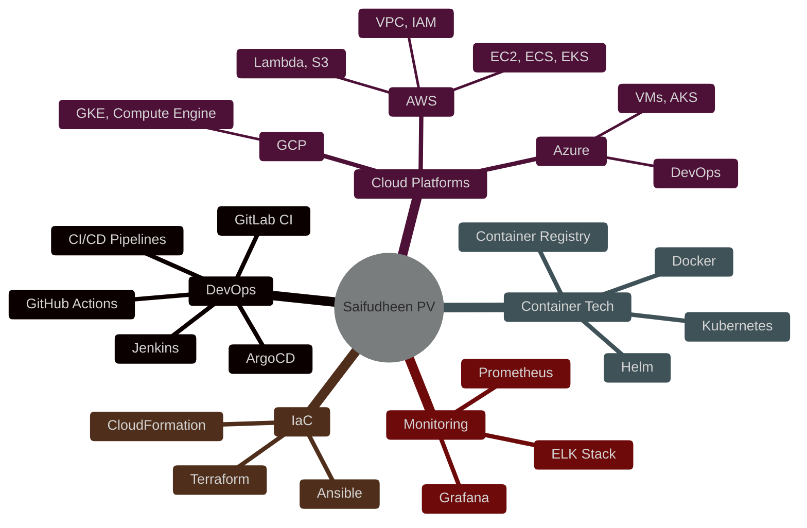

<div align="center">
  
</div>

<div align="center">
  
  # 👋 Hi, I'm Saifudheen PV
  
  
  
</div>

---

## 🚀 About Me
```yaml
name: Saifudheen PV
located_in: India
current_job: DevOps & Cloud Engineer
education:
  - "Bachelor's in Computer Science"
  
fields_of_interests:
  - "DevOps & Platform Engineering"
  - "Cloud Architecture (AWS, Azure, GCP)"
  - "Container Orchestration"
  - "CI/CD Automation"
  - "Infrastructure as Code"
  
technical_background:
  - "Kubernetes & Docker"
  - "Jenkins & GitOps"
  - "Spring Boot & Java"
  - "Terraform & Ansible"
  
currently_learning:
  - "Service Mesh (Istio/Linkerd)"
  - "Serverless Architecture"
  - "Microservices Design Patterns"
```

---

## 🛠️ Tech Stack & Tools

<div align="center">

### ☁️ Cloud & DevOps


### 💻 Programming & Frameworks


### 🗄️ Databases


### 📊 Monitoring & Observability


### 🔧 Tools & Platforms


</div>

---

## 📊 GitHub Stats

<div align="center">
  
  
  
  
  
  
  

</div>

---

## 🏆 GitHub Trophies

<div align="center">
  
  
  
</div>

---

## 🔥 Featured Projects

<div align="center">

[](https://github.com/Saifudheenpv/NebulaOps)
[](https://github.com/Saifudheenpv/Online-Book-Store)

</div>

---

## 💼 Experience & Skills

<div align="center">


</div>

---

## 📈 Contribution Graph

<div align="center">
  
  
  
</div>

---

## 🎯 Current Focus
```typescript
const currentlyWorkingOn = {
  project: "NebulaOps - GitOps Platform",
  learning: ["Service Mesh", "Istio", "Advanced Kubernetes"],
  goals: [
    "Build production-grade platforms",
    "Master cloud-native technologies",
    "Contribute to open-source projects"
  ],
  certifications: [
    "AWS Solutions Architect (In Progress)",
    "Certified Kubernetes Administrator (CKA)",
    "Red Hat Certified Engineer (RHCE)"
  ]
};
```

---

## 📫 Connect With Me

<div align="center">
  
  [](https://linkedin.com/in/saifudheenpv)
  [](https://github.com/Saifudheenpv)
  [](mailto:mesaifudheenpv@gmail.com)
  [](https://twitter.com/pvvsaifudheen)
  [](https://yourportfolio.com)
  
</div>

---

## 💡 Random Dev Quote

<div align="center">
  
  
  
</div>

---

## 📊 Profile Views Counter

<div align="center">
  
  
  
</div>

---

<div align="center">
  
  ### 🚀 "Building the future, one commit at a time" 🚀
  
  
  
</div>
