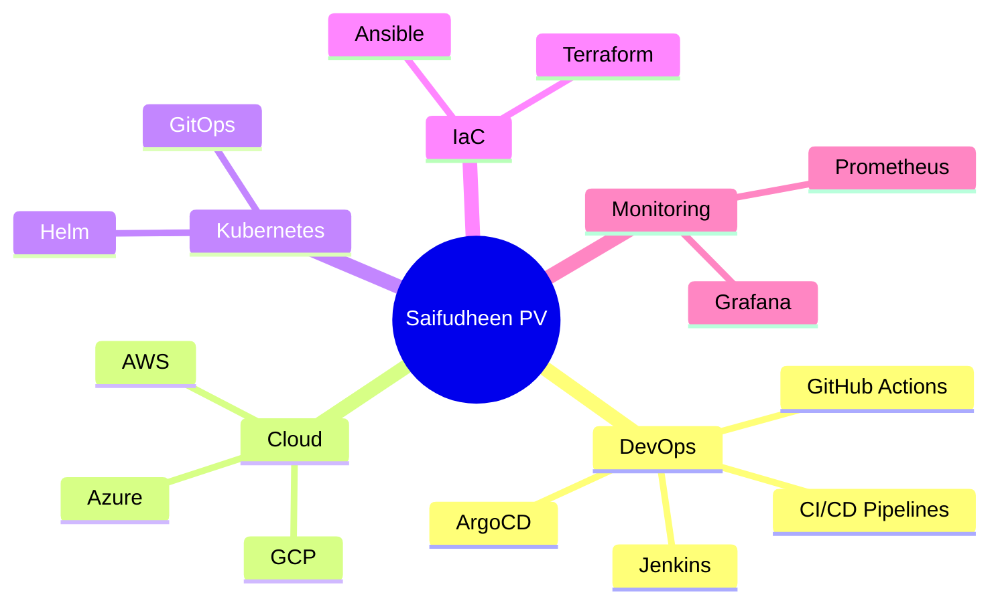

<div align="center">
  
</div>

<div align="center">
  
## 👋 Hi, I'm Saifudheen PV


</div>

---

## 🚀 About Me
```yaml
name: Saifudheen PV
location: India 🇮🇳
current_role: DevOps & Cloud Engineer
education:
  - Bachelor's in Computer Science

interests:
  - DevOps & Platform Engineering
  - Cloud Architecture (AWS, Azure, GCP)
  - Kubernetes & Containers
  - CI/CD Automation
  - Infrastructure as Code

skills:
  - Docker & Kubernetes
  - Jenkins, GitHub Actions, GitLab CI
  - Terraform & Ansible
  - Spring Boot & Java
  - Monitoring & Observability
```

---

## 🛠️ Tech Stack & Tools

### ☁️ Cloud & DevOps
<p align="center">
  
</p>

### 💻 Programming & Frameworks
<p align="center">
  
</p>

### 🗄️ Databases
<p align="center">
  
</p>

### 📊 Monitoring & Tools
<p align="center">
  
</p>

---

## 📊 GitHub Stats

<div align="center">
  
  
  
  
</div>

---

## 🏆 GitHub Trophies

<p align="center">
  
</p>

---

## 🔥 Featured Projects

<div align="center">

<a href="https://github.com/Saifudheenpv/NebulaOps">
  
</a>

<a href="https://github.com/Saifudheenpv/Online-Book-Store">
  
</a>

</div>

---

## 💼 Experience & Skills Map



---

## 🎯 Current Focus

```ts
const currentFocus = {
  building: "NebulaOps – GitOps Platform",
  learning: ["Advanced Kubernetes", "Istio", "Service Mesh"],
  goals: [
    "Production-grade DevOps systems",
    "Cloud-native mastery",
    "Open-source contribution"
  ],
  certifications: [
    "AWS Solutions Architect",
    "CKA",
    "RHCE"
  ]
}
```

---

## 📈 Contributions

<p align="center">
  
</p>

---

## 📫 Connect With Me

<p align="center">
  <a href="https://linkedin.com/in/saifudheenpv">
    
  </a>
  <a href="mailto:mesaifudheenpv@gmail.com">
    
  </a>
  <a href="https://github.com/Saifudheenpv">
    
  </a>
  <a href="https://twitter.com/pvvsaifudheen">
    
  </a>
</p>

---

## 👀 Profile Views

<p align="center">
  
</p>

---

<div align="center">
  <h3>🚀 Building the future, one commit at a time 🚀</h3>
  
</div>
